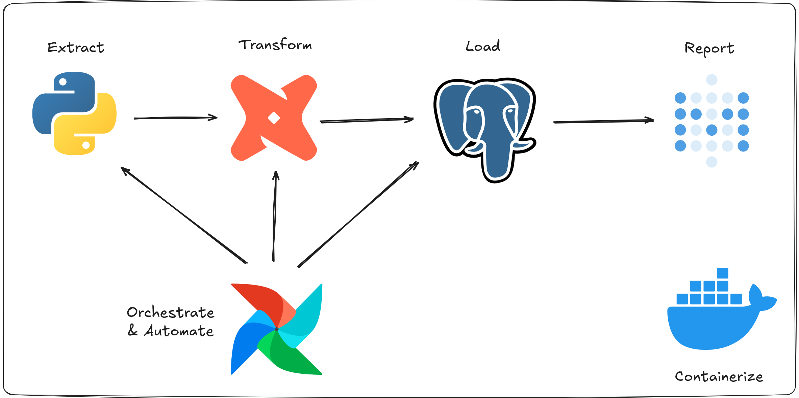

# Citibike ELT Pipeline



A complete ELT (Extract, Load, Transform) pipeline for processing NYC Citi Bike trip data using modern data engineering tools. This pipeline automates the ingestion, transformation, and visualization of Citi Bike data to enable insights into bike-sharing patterns and user behavior.

## Architecture

This project implements a sophisticated data pipeline using the following stack:

- **Apache Airflow**: Orchestration and workflow management
- **PostgreSQL**: Data storage and warehousing
- **dbt**: Data transformation and modeling
- **Metabase**: Business intelligence and visualization
- **Docker & Docker Compose**: Containerization and service orchestration

## Data Model

The pipeline transforms raw Citi Bike trip data into a star schema with the following tables:

### Fact Table

- **`fact_trips`**: Central fact table containing trip details
  - `trip_id` (surrogate key)
  - `tripduration`
  - `starttime`, `stoptime`
  - `start_station_id`, `end_station_id` (foreign keys)
  - `bike_id`
  - `user_id` (foreign key)

### Dimension Tables

- **`dim_station`**: Station information
  - `station_id` (primary key)
  - `station_name`
  - `latitude`, `longitude`

- **`dim_user`**: User demographics
  - `user_id` (primary key)
  - `usertype`
  - `birth_year`
  - `gender`

## Pipeline Flow

### 1. Ingestion DAG (`ingestion_dag.py`)

- Downloads annual Citi Bike trip data from NYC public dataset
- Extracts ZIP files containing monthly CSV files
- Loads raw data into PostgreSQL `raw_trips` table
- Handles data type conversion and column naming standardization
- Processes data in chunks for memory efficiency

### 2. Transformation DAG (`transformation_dag.py`)

- Executes dbt transformations using Docker containers
- Creates dimensional models from raw staging data
- Implements surrogate key generation for proper star schema
- Ensures data quality through deduplication and validation

## Quick Start

### Prerequisites

- Docker and Docker Compose
- Git

### Setup

1. **Clone the repository**

   ```bash
   git clone <repository-url>
   cd Citibike-ELT-Pipeline
   ```

2. **Configure environment variables**

   ```bash
   cp .env.sample .env
   # Edit .env to set:
   #  AIRFLOW_UID (run `id -u` to get your user ID)
   #  DOCKER_SOCKET_GROUP_ID (run `stat -c '%g' /var/run/docker.sock` to get docker socket group ID)
   ```

3. **Update sources in `transformation_dag.py`**

   ```python
    # Make sure it is the absolute path
    mounts = [
        Mount(
            source="**/Citibike-ELT-Pipeline/dbt", # here
            target="/usr/app",
            type="bind",
        ),
        Mount(
            source="**/Citibike-ELT-Pipeline/dbt", # here
            target="/root/.dbt",
            type="bind",
        ),
    ]
   ```

4. **Install dbt dependencies (first time only)**

   ```bash
   docker compose run dbt deps
   ```

5. **Start the services**

   ```bash
   docker compose up -d
   ```

6. **Access the services**
   - **Airflow UI**: http://localhost:8080
   - **Metabase**: http://localhost:3000
   - **PostgreSQL**: localhost:5432

### Running the Pipeline

1. **Manual trigger via Airflow UI**
   - Navigate to Airflow UI at http://localhost:8080
   - Enable and manually trigger the `ingestion_dag`
   - Once ingestion completes, trigger the `transformation_dag`

2. **Automatic execution**
   - DAGs are scheduled to run daily
   - Ingestion runs first, followed by transformation

### Metabase Setup

1. Access Metabase at http://localhost:3000
2. Set up admin account
3. Connect to PostgreSQL database:
   - Host: `postgres`
   - Port: `5432`
   - Database: `citibike_db`
   - Username: `postgres`
   - Password: `password`

4. Explore the pre-built visualization tables:
   - `fact_trips`
   - `dim_station`
   - `dim_user`

## Project Structure

```
Citibike-ELT-Pipeline/
├── airflow/
│   ├── dags/                 # Airflow DAG definitions
│   │   ├── ingestion_dag.py
│   │   └── transformation_dag.py
│   └── Dockerfile
├── dbt/
│   ├── profiles.yml         # dbt database configuration
│   └── citibike_project/
│       ├── dbt_project.yml  # dbt project configuration
│       └── models/
│           ├── staging/     # Staging models
│           │   ├── stg_trips.sql
│           │   └── src_citibike.yml
│           └── marts/       # Dimensional models
│               ├── fact_trips.sql
│               ├── dim_station.sql
│               └── dim_user.sql
├── postgres/
│   ├── airflow-init.sql     # Airflow database setup
│   └── metabase-init.sql   # Metabase database setup
├── assets/                 # Documentation images
├── dataset-vol/           # Data storage volume
├── compose.yml            # Docker Compose configuration
└── .env.sample           # Environment variables template
```

## Configuration

### Environment Variables (.env)

- `AIRFLOW_UID`: Your system user ID (required for Airflow permissions)
- `DOCKER_SOCKET_GROUP_ID`: Docker socket group ID (required for Airflow `DockerOperator` to run)

### Database Configuration

- PostgreSQL connection details are configured in `compose.yml`
- dbt profile configured in `dbt/profiles.yml`
- Supports easy modification for different environments

## Data Source

This pipeline processes NYC Citi Bike trip data from the official public dataset:

- Source: `https://s3.amazonaws.com/tripdata/index.html`
- Data format: CSV files compressed in annual ZIP archives
- Current implementation focuses on **2014** data (easily modifiable for other years)

## Monitoring and Observability

- **Airflow UI**: Monitor DAG execution, task status, and logs
- **Metabase**: Business intelligence dashboards and ad-hoc analysis
- **PostgreSQL**: Direct database access for data validation
- **dbt logs**: Transformation execution details in `dbt/citibike_project/logs/`

## Development

### Adding New Transformations

1. Create new SQL models in `dbt/citibike_project/models/`
2. Update `dbt_project.yml` if needed
3. Test with `docker compose run dbt run --models <your_model>`

### Extending Data Sources

1. Modify `ingestion_dag.py` for new data sources
2. Update source definitions in `models/staging/src_citibike.yml`
3. Add appropriate staging models

### Performance Optimization

- Adjust `CHUNK_SIZE` in ingestion DAG for memory optimization
- Configure dbt threads in `profiles.yml` for parallel processing
- Monitor PostgreSQL performance for large datasets

## Troubleshooting

### Common Issues

1. **Permission errors**:
   - Ensure correct `AIRFLOW_UID` and `DOCKER_SOCKET_GROUP_ID` in `.env`
   - If you encounter permission denied on `/opt/airflow/data` just run:
     ```bash
     sudo chown -R $(id -u):$(id -g) ./dataset-vol
     ```
2. **Database connection**: Verify PostgreSQL container is healthy
3. **Memory issues**: Reduce `CHUNK_SIZE` in ingestion tasks
4. **Docker volume conflicts**: Clean up existing volumes if needed
